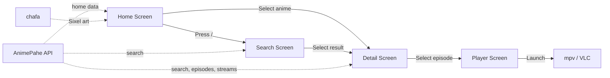

<p align="center">
  
  
  
  
  
</p>

<h1 align="center">
  ★ ANI-EX
</h1>

<p align="center">
  <strong>Anime streaming TUI — watch anime directly from your terminal.</strong>
</p>

<p align="center">
  A premium, feature-rich terminal user interface for browsing, searching, and streaming anime.<br/>
  Built with <a href="https://github.com/embark-theme/neo-blessed">neo-blessed</a> and powered by <a href="https://animepahe.pw">AnimePahe</a>.
</p>

<p align="center">
  <a href="#-features">Features</a> •
  <a href="#%EF%B8%8F-installation">Installation</a> •
  <a href="#-usage">Usage</a> •
  <a href="#%EF%B8%8F-keybindings">Keybindings</a> •
  <a href="#-architecture">Architecture</a> •
  <a href="#-license">License</a>
</p>

---

## ✨ Features

- **🏠 Rich Home Dashboard** — Spotlight carousel, trending anime, and latest releases with auto-rotating highlights
- **🖼️ Sixel Image Rendering** — Anime poster art rendered directly in the terminal via [chafa](https://hpjansson.org/chafa/) with intelligent caching
- **🔍 Instant Search** — Search AnimePahe's full catalog with recent search history and top airing suggestions
- **📋 Episode Browser** — Detailed anime info panel with episode lists, genre tags, and SUB/DUB toggle
- **▶️ One-Click Playback** — Stream episodes directly in [mpv](https://mpv.io/) (default) or [VLC](https://www.videolan.org/) with automatic quality selection
- **🎨 Premium Design** — Deep purple/indigo color palette, gradient accents, box-drawing UI, and smooth animations
- **⌨️ Keyboard-First Navigation** — Full vim-style navigation with contextual status bar hints
- **📐 Responsive Layout** — Full re-render on terminal resize with no visual artifacts
- **💾 Persistent Config** — Player preference and search history saved to `~/.aniex/config.json`

## 🛠 Prerequisites

| Dependency | Purpose | Required |
|:---|:---|:---:|
| [Bun](https://bun.sh/) | JavaScript runtime & package manager | ✅ |
| [Scoop](https://scoop.sh/) | Windows package manager (for installing tools) | ✅ |
| [mpv](https://mpv.io/) | Video player (default) | ✅* |
| [VLC](https://www.videolan.org/) | Video player (fallback) | ⚠️ |
| [chafa](https://hpjansson.org/chafa/) | Terminal image rendering (Sixel) | ⚠️ |

> \* At least one video player (mpv or VLC) is required for playback.  
> chafa is optional but **highly recommended** for poster art in the home screen.

## ⚙️ Installation

### 1. Install Scoop (if not already installed)

Open PowerShell and run:

```powershell
Set-ExecutionPolicy -ExecutionPolicy RemoteSigned -Scope CurrentUser
Invoke-RestMethod -Uri https://get.scoop.sh | Invoke-Expression
```

### 2. Install dependencies via Scoop

```powershell
# Install Bun runtime
scoop install bun

# Install video player (at least one is required)
scoop install mpv     # Recommended
scoop install vlc     # Optional fallback

# Install chafa for terminal poster art (optional but recommended)
scoop bucket add extras
scoop install chafa
```

### 3. Clone and install

```powershell
git clone https://github.com/KiyoKun01/AnimeCLI.git
cd AnimeCLI
bun install
```

### 4. Run

```powershell
bun start
```

Or run directly:

```powershell
bun src/index.js
```

### Global Installation (optional)

To install `ani-ex` as a global command:

```powershell
bun link
```

Then run from anywhere:

```powershell
ani-ex
```

## 🚀 Usage

Launch the app and you'll land on the **Home** screen with three sections:

| Section | Description |
|:---|:---|
| **★ Spotlight** | Auto-rotating featured anime with poster art and synopsis |
| **Trending Now** | Horizontally scrollable grid of popular anime cards |
| **Latest Releases** | Recently aired episodes with episode numbers |

Use arrow keys to navigate between sections and cards, press **Enter** to view details, or press **/** to jump into search.

### Navigation Flow

```
Home → Search → Detail → Player
  ↑       ↑        ↑
  └───────┴────────┘  (press b to go back)
```

## ⌨️ Keybindings

### Global

| Key | Action |
|:---:|:---|
| `q` / `Ctrl+C` | Quit application |
| `/` | Open search / focus search bar |
| `r` | Refresh current screen |
| `b` | Go back to previous screen |

### Home Screen

| Key | Action |
|:---:|:---|
| `↑` `↓` | Navigate between sections (Spotlight → Trending → Latest) |
| `←` `→` | Scroll through anime cards |
| `Enter` | Select anime → go to Detail screen |

### Search Screen

| Key | Action |
|:---:|:---|
| `/` | Focus search input |
| `Esc` | Exit search input / unfocus |
| `↑` `↓` | Navigate results |
| `Enter` | Select result → go to Detail screen |
| `c` | Clear search history |
| `h` | Go to Home |

### Detail Screen

| Key | Action |
|:---:|:---|
| `↑` `↓` | Navigate episode list |
| `Tab` | Toggle SUB / DUB mode |
| `Enter` | Select episode → go to Player |

### Player Screen

| Key | Action |
|:---:|:---|
| `↑` `↓` | Select stream quality |
| `Enter` | Launch in video player (mpv/VLC) |

## 🏗 Architecture

```
src/
├── index.js              # Entry point, screen manager & navigation stack
├── api/
│   └── provider.js       # AnimePahe API (search, episodes, streams, home data)
├── ui/
│   ├── layout.js         # Persistent shell (header, content area, status bar)
│   ├── components.js     # Design system (colors, box-drawing, widgets)
│   ├── home.js           # Home dashboard (spotlight, trending, latest)
│   ├── search.js         # Search screen with history & suggestions
│   ├── detail.js         # Anime detail view with episode list
│   └── player.js         # Stream quality selector & player launcher
└── utils/
    ├── config.js          # Persistent config (~/.aniex/config.json)
    ├── image.js           # Sixel image rendering via chafa
    └── player.js          # Video player launcher (mpv/VLC)
```

### Layer Overview

| Layer | Files | Responsibility |
|:---|:---|:---|
| **Entry & Routing** | `index.js` | Navigation stack, screen lifecycle, resize handling |
| **API** | `api/provider.js` | AnimePahe search, episode fetching, stream resolution |
| **UI** | `ui/*.js` | Terminal rendering, layout, components, keyboard navigation |
| **Utils** | `utils/*.js` | Config persistence, image rendering, player spawning |

### Data Flow



## ⚡ Terminal Recommendations

For the best experience, use a terminal that supports:

- **Truecolor** (24-bit color) — Required for the full color palette
- **Sixel graphics** — Required for poster art rendering
- **Unicode** — Required for box-drawing characters and icons

### Recommended Terminals

| Terminal | Truecolor | Sixel | Notes |
|:---|:---:|:---:|:---|
| **Windows Terminal** | ✅ | ✅ | Best experience on Windows |
| **WezTerm** | ✅ | ✅ | Cross-platform, excellent Sixel support |
| **Kitty** | ✅ | ❌ | Uses its own image protocol |
| **iTerm2** | ✅ | ✅ | macOS only |

## 📝 Configuration

ANI-EX stores its configuration at `~/.aniex/config.json`:

```json
{
  "player": "mpv",
  "recentSearches": ["Naruto", "One Piece"]
}
```

| Key | Values | Default | Description |
|:---|:---|:---:|:---|
| `player` | `"mpv"` \| `"vlc"` | `"mpv"` | Preferred video player |
| `recentSearches` | `string[]` | `[]` | Last 5 search queries |

## 🤝 Contributing

Contributions are welcome! Here's how to get started:

1. **Fork** the repository
2. **Create** a feature branch: `git checkout -b feature/my-feature`
3. **Commit** your changes: `git commit -m "feat: add my feature"`
4. **Push** to your fork: `git push origin feature/my-feature`
5. **Open** a Pull Request

## 📄 License

This project is licensed under the **MIT License** — see the [LICENSE](LICENSE) file for details.

## ⚠️ Disclaimer

ANI-EX is a tool for personal use. It does not host or distribute any anime content. All streams are fetched from third-party providers. Please support the official anime industry by purchasing licensed content.

---

<p align="center">
  <strong>Made with 💜 by <a href="https://github.com/KiyoKun01">KiyoKun01</a></strong>
</p>
